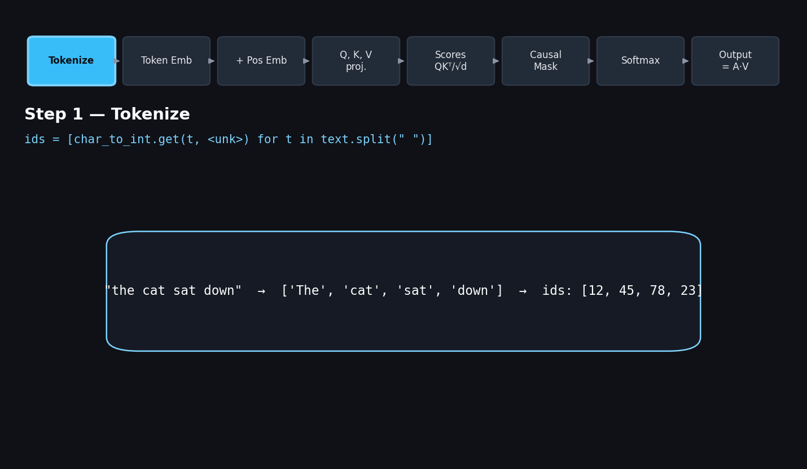

# TinyGPT

A minimal, from-scratch, decoder-only GPT implemented in PyTorch — built to understand every piece of a transformer language model rather than to import one. This README documents the math and architecture behind each component in this folder.


*A toy pass (4 tokens, `d_model = 8` for readability) through tokenization → embeddings → causal self-attention, with real numbers at every step.*

## Contents

| File | What it implements |
|---|---|
| `tokenizer.py` | Word-level tokenizer: builds a vocabulary and converts text ⇄ token ids |
| `embeddings.py` | Token embedding table + learned positional embedding table |
| `attention.py` | Single-head **causal** (masked) scaled dot-product self-attention |
| `train_eval.py` | Training loop (cross-entropy + AdamW) and greedy autoregressive generation |
| `data.txt` | Raw training corpus |

> **Note on repo state:** `train_eval.py` imports a `TinyGPT` model from a `transformer.py` module that assembles the pieces above into a full network — that file isn't in the repo yet. Sections 1–3 below document what's actually implemented; Section 4 documents the training loop as written; Section 5 lays out the standard architecture `transformer.py` needs to provide so the pieces fit together, since that's the natural next file to add.

---

## 1. Tokenizer (`tokenizer.py`)

A word-level tokenizer (splits on whitespace, not sub-word/BPE). The vocabulary is built once from a text corpus:

$$V = \{\texttt{<pad>}, \texttt{<unk>}\} \cup \text{sorted}(\text{unique}(\text{words}))$$

**Encoding** a string maps each whitespace-separated token to its id, falling back to `<unk>` for anything unseen:

$$\text{id}(t) = \begin{cases} \text{char\_to\_int}[t] & \text{if } t \in V \\ \text{id}(\texttt{<unk>}) & \text{otherwise} \end{cases}$$

**Decoding** is the inverse lookup, joined back into a string with spaces. Because splitting is purely on `" "`, punctuation stays glued to words (`"cat."` and `"cat"` are different tokens) — a known limitation of this simple scheme versus BPE/WordPiece.

---

## 2. Embeddings (`embeddings.py`)

Two separate learned lookup tables, each initialized as $\mathcal{N}(0,1) \cdot \frac{1}{\sqrt{d_{model}}}$ (keeps initial activation variance ≈ 1 regardless of dimension):

**Token embedding** — maps a token id to a vector:
$$E_{tok}(x_i) = W_{tok}[x_i], \qquad W_{tok} \in \mathbb{R}^{|V| \times d_{model}}$$

**Positional embedding** — maps a *position* (not a token) to a vector, looked up by index `0..seq_len-1`:
$$E_{pos}(i) = W_{pos}[i], \qquad W_{pos} \in \mathbb{R}^{L_{max} \times d_{model}}$$

The two are summed elementwise to give the model's actual input representation:

$$X_i = E_{tok}(x_i) + E_{pos}(i)$$

This is the same additive (learned, non-sinusoidal) positional encoding used in GPT-2, as opposed to the fixed sinusoidal encoding from the original "Attention Is All You Need" paper.

Shape: input `(batch, seq_len)` of token ids → output `(batch, seq_len, d_model)`.

---

## 3. Causal Self-Attention (`attention.py`)

Single-head scaled dot-product attention, masked so each position can only attend to itself and earlier positions (autoregressive / causal). Given input $X \in \mathbb{R}^{T \times d}$:

**1. Project into queries, keys, values** (linear, no bias):
$$Q = XW_Q, \quad K = XW_K, \quad V = XW_V \qquad W_Q, W_K, W_V \in \mathbb{R}^{d \times d}$$

**2. Raw compatibility scores** between every pair of positions, scaled by $\sqrt{d_k}$ to keep the softmax's input variance stable (otherwise large-dimension dot products push softmax into saturated, near-zero-gradient regions):
$$\text{scores} = \frac{QK^\top}{\sqrt{d_k}}$$

**3. Causal mask** — zero out (set to $-\infty$) every entry where a token would attend to a *future* token, using a lower-triangular mask:
$$\text{scores}_{ij} = \begin{cases} \text{scores}_{ij} & j \le i \\ -\infty & j > i \end{cases}$$

**4. Softmax** turns each row into a probability distribution over "which earlier tokens matter":
$$A = \text{softmax}(\text{scores}, \dim=-1), \qquad \sum_j A_{ij} = 1$$

**5. Weighted sum of values** — the actual output, a context-aware representation of each token:
$$\text{output} = AV$$

Since this is a *single* head, $d_k = d_{model}$ (no splitting into multiple smaller subspaces the way multi-head attention does). The repo's own test in `attention.py` verifies the mask works by asserting the upper-triangular half of the attention-weight matrix sums to exactly 0.

---

## 4. Training loop (`train_eval.py`)

Standard next-token-prediction language modeling:

**Loss** — cross-entropy between predicted next-token distribution and the actual next token, averaged over the sequence:
$$\mathcal{L} = -\frac{1}{T}\sum_{t=1}^{T} \log P(x_{t+1} \mid x_{\le t})$$

- Optimizer: **AdamW**, `lr = 3e-4`
- Context window: `block_size = 64` tokens
- Model width: `d_model = 128`
- Targets are the input sequence shifted by one position (`y = x[1:block_size+1]`)

**Generation** is greedy decoding: repeatedly run the model on the last `block_size` tokens, take $\arg\max$ over the final position's logits, append it, and repeat.

Before running this file as-is, a couple of things worth double-checking: it does `for epoch in epochs:` where `epochs = 1000` is an int (needs `range(epochs)`), and it imports `Tokenizer` with a capital T while the class in `tokenizer.py` is lowercase `tokenizer`.

---

## 5. Completing the model — `transformer.py` (proposed)

`train_eval.py` already calls the shape this needs to have:

```python
model = TinyGPT(vocab_size=len(tokenizer.vocab), max_seq_len=block_size, d_model=128)
```

To get there, stack the `Embeddings` + `SingleHeadAttention` blocks above into the standard **pre-norm decoder-only transformer** used by GPT-style models:

**Residual connection** around every sub-layer:
$$x' = x + \text{Sublayer}(\text{LayerNorm}(x))$$

**LayerNorm**, applied per-token over the feature dimension:
$$\hat{x} = \frac{x - \mu}{\sqrt{\sigma^2 + \epsilon}} \cdot \gamma + \beta$$

**Feed-forward network** — a per-token 2-layer MLP that expands then projects back down (typically 4×):
$$\text{FFN}(x) = W_2 \cdot \text{GELU}(W_1 x + b_1) + b_2, \qquad W_1 \in \mathbb{R}^{d \times 4d},\ W_2 \in \mathbb{R}^{4d \times d}$$

**One decoder block**, combining the two:
```
x = x + Attention(LayerNorm(x))
x = x + FeedForward(LayerNorm(x))
```

**Full model** — embed, run through $N$ stacked blocks, final norm, then project to vocabulary size to get logits:
$$h = \text{Embeddings}(x)$$
$$h = \text{Block}_N(\dots\text{Block}_1(h)\dots)$$
$$\text{logits} = \text{LayerNorm}(h)\, W_{out}, \qquad W_{out} \in \mathbb{R}^{d_{model} \times |V|}$$

At inference, `softmax(logits)` over the last position gives the next-token distribution `train_eval.py`'s `generate()` function already samples from via $\arg\max$.

The only upgrade from single-head to **multi-head** attention (the more common choice in real GPTs) is splitting $Q,K,V$ into $h$ smaller heads of dimension $d/h$, running the same attention math on each in parallel, and concatenating the results back to $d$ before a final output projection — everything else above stays the same.

---

## Notation reference

| Symbol | Meaning |
|---|---|
| $\|V\|$ | Vocabulary size |
| $d_{model}$ | Embedding / hidden dimension (128 in `train_eval.py`) |
| $T$ / `seq_len` | Number of tokens in the current sequence |
| $L_{max}$ | Max context length the model supports (`block_size = 64`) |
| $Q, K, V$ | Query, Key, Value matrices |
| $A$ | Attention weight matrix (post-softmax) |
| $N$ | Number of stacked decoder blocks |

## Running it

```bash
pip install torch
python train_eval.py   # once transformer.py exists
```
